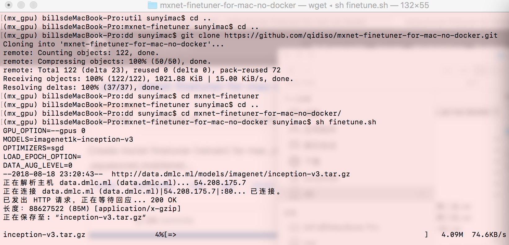
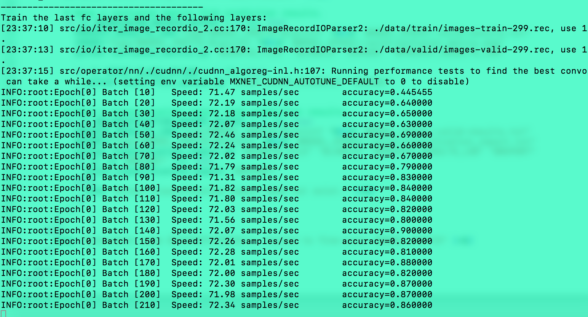

# mxnet-finetuner-for-mac-no-docker
Create mxnet fine tuner for mac ,no need install docker and support GPU(egpu).
## Prerequisites
python 2.7 mxnet(cpu) or mxnet-cu80 (you need setup egpu for mac)
RUN pip install \
  attrdict \
  awscli \
  jupyter \
  matplotlib \
  nose \
  nose-timer \
  numpy \
  opencv-python \
  pandas \
  pandas_ml \
  Pillow \
  pylint \
  pyyaml \
  requests \
  seaborn \
  sklearn-pandas \
  slackclient \
  tqdm
  
  ## Setup

  
  ### 1. Arrange images into their respective directories

A training data directory (`images/train`), validation data directory (`images/valid`), and test data directory (`images/test`) should containing one subdirectory per image class.

For example, arrange training, validation, and test data as follows.

```
images/
    train/
        airplanes/
            airplane001.jpg
            airplane002.jpg
            ...
        watch/
            watch001.jpg
            watch002.jpg
            ...
    valid/
        airplanes/
            airplane101.jpg
            airplane102.jpg
            ...
        watch/
            watch101.jpg
            watch102.jpg
            ...
    test/
        airplanes/
            airplane201.jpg
            airplane202.jpg
            ...
        watch/
            watch201.jpg
            watch202.jpg
            ...
```


### 2. Edit config/config.yml

Edit `config.yml` as you like.

For example
```
common:
  num_threads: 4
  gpus: 0

data:
  quality: 100
  shuffle: 1
  center_crop: 0

finetune:
  models:
    - imagenet1k-resnet-50
  optimizers:
    - sgd
  num_epochs: 30
  lr: 0.0001
  lr_factor: 0.1
  lr_step_epochs: 10,20
  mom: 0.9
  wd: 0.00001
  batch_size: 10
```

### 3. Do Fine-tuning

```
$ sh finetune.sh
```

mxnet-finetuner will automatically execute the followings according to `config.yml`.

- Create RecordIO data from images
- Download pretrained models
- Replace the last fully-connected layer with a new one that outputs the desired number of classes
- Data augumentaion
- Do Fine-tuning
- Make training accuracy graph
- Make confusion matrix
- Upload training accuracy graph and confusion matrix to Slack

Training accuracy graph and/or confusion matrix are save at `logs/` directory.  
Trained models are save at `model/` directory.

Trained models are saved with the following file name for each epoch.
```
model/201705292200-imagenet1k-nin-sgd-0000.params
```

If you want to upload results to Slack, set `SLACK_API_TOKEN` environment variable and edit `config.yml` as below.
```
finetune:
  train_accuracy_graph_slack_upload: 1
test:
  confusion_matrix_slack_upload: 1
```


continue:

### 4. Predict with trained models

Select the trained model and epoch you want to use for testing and edit `config.yml`

If you want to use `model/201705292200-imagenet1k-nin-sgd-0001.params`, edit `config.yml` as blow.

```
test:
  model: 201705292200-imagenet1k-nin-sgd-0001
```

When you want to use the latest highest validation accuracy trained model, edit `config.yml` as below.

```
test:
  use_latest: 1
```

If set this option, `model` is ignored.

When you are done, you can predict with the following command

```
$ docker-compose run finetuner test
```

Predict result and classification report and/or confusion matrix are save at `logs/` directory.


## Available pretrained models

|model                          |pretrained model name            |
|:------------------------------|:--------------------------------|
|CaffeNet                       |imagenet1k-caffenet              |
|SqueezeNet                     |imagenet1k-squeezenet            |
|NIN                            |imagenet1k-nin                   |
|VGG16                          |imagenet1k-vgg16                 |
|Inception-BN                   |imagenet1k-inception-bn          |
|ResNet-50                      |imagenet1k-resnet-50             |
|ResNet-152                     |imagenet1k-resnet-152            |
|Inception-v3                   |imagenet1k-inception-v3          |
|DenseNet-169                   |imagenet1k-densenet-169          |
|SE-ResNeXt-50                  |imagenet1k-se-resnext-50         |

To use these pretrained models, specify the following pretrained model name in `config.yml`.

For details, please check [Available pretrained models](docs/pretrained_models.md)


## Available optimizers

- SGD
- NAG
- RMSProp
- Adam
- AdaGrad
- AdaDelta
- Adamax
- Nadam
- DCASGD
- SGLD
- Signum
- FTML
- Ftrl

To use these optimizers, specify the optimizer name in lowercase in `config.yml`.


## Benchmark (Speed and Memory Footprint)

Single TITAN X (Maxwell) with batch size 40

|Model       |speed (images/sec)|memory (MiB)|
|:-----------|:-----------------|:-----------|
|CaffeNet    |1077.63           |716         |
|ResNet-50   |111.04            |5483        |
|Inception-V3|82.34             |6383        |
|ResNet-152  |48.28             |11330       |

For details, please check [Benchmark](docs/benchmark.md)

## Utilities

### counter.sh

Count the number of files in each subdirectory.

```
$ counter.sh testdir
testdir contains 4 directories
Leopards    197
Motorbikes  198
airplanes   199
watch       200
```

### move_images.sh

Move the specified number of jpeg images from the target directory to the output directory while maintaining the directory structure.

```
$ move_images.sh 20 testdir newdir
processing Leopards
processing Motorbikes
processing airplanes
processing watch
$ counter.sh newdir
newdir contains 4 directories
Leopards    20
Motorbikes  20
airplanes   20
watch       20
```

### Prepare sample images for fine-tuning

Download [Caltech 101] dataset, and split part of it into the `example_images` directory.

```
$ caltech101_prepare.sh
```

- `example_images/train` is train set of 60 images for each classes
- `example_images/valid` is validation set of 20 images for each classes
- `example_imags/test` is test set of 20 images for each classes

```
$ counter.sh example_images/train
example_images/train contains 10 directories
Faces       60
Leopards    60
Motorbikes  60
airplanes   60
bonsai      60
car_side    60
chandelier  60
hawksbill   60
ketch       60
watch       60
```

With this data you can immediately try fine-tuning.

```
$ caltech101_prepare.sh
$ rm -rf images
$ mv exmaple_images images
$ sh finetune.sh
```


## Misc

### How to freeze layers during fine-tuning

If you set the number of target layer to `finetune.num_active_layers` in `config.yml` as below, only layers whose number is not greater than the number of the specified layer will be train.

```
finetune:
  models:
    - imagenet1k-nin
  optimizers:
    - sgd
  num_active_layers: 6
```

The default for `finetune.num_active_layers` is `0`, in which case all layers are trained.

If you set `1` to `finetune.num_active_layers`, only the last fully-connected layers are trained.

You can check the layer numbers of various pretrained models with `num_layers` command.

```
$ sh finetune.sh num_layers <pretrained model name>
```

For details, please check [How to freeze layers during fine-tuning](docs/freeze_layers.md)


### Training from scratch

Edit `config.yml` as below.

```
finetune:
  models:
    - scratch-alexnet
```

You can also run fine-tuning and training from scratch together.

```
finetune:
  models:
    - imagenet1k-inception-v3
    - scratch-inception-v3
```

For details, please check [Available models training from scratch](docs/train_from_scratch.md)

## Refrence

Mxnet-finetuner(https://github.com/knjcode/mxnet-finetuner)
